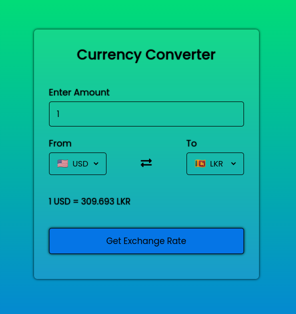

# Currency Converter App

This is a simple currency converter app built using HTML, CSS, and JavaScript/jQuery. It allows users to convert between different currencies using the latest exchange rates obtained from an external API. The app also displays country flags corresponding to the selected currencies.



## Demo

You can see a live demo of the currency converter app [here](https://rasindu-hansika.github.io/Currency-Converter-App/).

## Features

- Currency conversion: Convert values between different currencies.
- Real-time exchange rates: Fetches the latest exchange rates from the exchangerate API.
- Country flags: Displays the flags of the selected currencies.
- User-friendly interface: Easy-to-use and intuitive design.

## Usage
- Select the base currency from the dropdown list.
- Enter the amount you want to convert.
- Choose the target currency from the second dropdown list.
- The converted amount will be displayed instantly, along with the corresponding country flags

## Dependencies
- jQuery: A fast and feature-rich JavaScript library for easier DOM manipulation.
- exchangerate API: An API that provides real-time exchange rates for various currencies. Visit site [here](https://app.exchangerate-api.com/).
- CDN (HTTP API): A content delivery network that hosts country flag images for the app. Visit site [here](https://flagpedia.net/).

## Note 
- If you're using the exchangerate API, make sure to update the API key in the JavaScript code with your own API key. You can obtain an API key   by signing up on the exchangerate API website.

## Installation

Clone the repository or download the source code.

```shell
git clone https://github.com/Rasindu-Hansika/Currency-Converter-App.git

